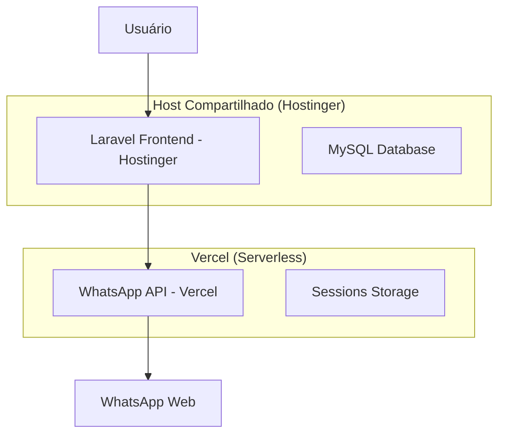

# 🚀 Deploy Híbrido: WhatsApp API (Vercel) + Laravel (Hostinger)

## 📋 Visão Geral

Esta documentação explica como fazer o deploy separado dos serviços:
- **Node.js WhatsApp API** → Vercel (Serverless)
- **Laravel Dashboard** → Hostinger (Host Compartilhado)

## 🎯 Arquitetura Final



## 📁 Preparação dos Arquivos

### 1. Estrutura para Vercel (Node.js)

Crie uma pasta separada `whatsapp-api-vercel/`:

```
whatsapp-api-vercel/
├── api/
│   ├── sessions.js
│   ├── chats.js
│   ├── groups.js
│   └── test.js
├── lib/
│   ├── whatsapp.js
│   └── utils.js
├── package.json
├── vercel.json
└── .env.example
```

### 2. Estrutura para Hostinger (Laravel)

Mantenha no host compartilhado:
```
public_html/
├── app/
├── config/
├── resources/
├── routes/
├── .env
└── index.php
```

## 🔧 Configuração do Vercel

### 1. Arquivo `vercel.json`

```json
{
  "version": 2,
  "builds": [
    {
      "src": "api/**/*.js",
      "use": "@vercel/node"
    }
  ],
  "routes": [
    {
      "src": "/api/(.*)",
      "dest": "/api/$1"
    }
  ],
  "env": {
    "NODE_ENV": "production"
  },
  "functions": {
    "api/**/*.js": {
      "maxDuration": 30
    }
  }
}
```

### 2. Package.json para Vercel

```json
{
  "name": "whatsapp-api-vercel",
  "version": "1.0.0",
  "description": "WhatsApp API for Vercel",
  "main": "api/index.js",
  "scripts": {
    "dev": "vercel dev",
    "build": "echo 'No build step required'",
    "start": "node api/index.js"
  },
  "dependencies": {
    "@adiwajshing/baileys": "^6.6.0",
    "qrcode": "^1.5.3",
    "axios": "^1.6.0",
    "cors": "^2.8.5",
    "express": "^4.18.2",
    "pino": "^8.16.0",
    "dotenv": "^16.3.1"
  },
  "engines": {
    "node": "18.x"
  }
}
```

### 3. API Routes para Vercel

**`api/sessions.js`**
```javascript
import { makeWASocket, DisconnectReason, useMultiFileAuthState } from '@adiwajshing/baileys';
import QRCode from 'qrcode';

export default async function handler(req, res) {
  // Configurar CORS
  res.setHeader('Access-Control-Allow-Origin', process.env.FRONTEND_URL || '*');
  res.setHeader('Access-Control-Allow-Methods', 'GET, POST, DELETE');
  res.setHeader('Access-Control-Allow-Headers', 'Content-Type');

  if (req.method === 'OPTIONS') {
    return res.status(200).end();
  }

  try {
    if (req.method === 'POST') {
      // Criar nova sessão
      const { sessionId } = req.body;
      
      // Implementar lógica de criação de sessão
      const qrCode = await generateQRCode(sessionId);
      
      return res.json({
        success: true,
        sessionId,
        qrCode
      });
    }
    
    if (req.method === 'GET') {
      // Listar sessões ativas
      return res.json({
        success: true,
        sessions: await getActiveSessions()
      });
    }
    
  } catch (error) {
    return res.status(500).json({
      success: false,
      error: error.message
    });
  }
}

async function generateQRCode(sessionId) {
  // Implementar geração de QR Code
  // Retornar base64 do QR Code
}
```

## 🌐 Configuração do Laravel (Hostinger)

### 1. Variáveis de Ambiente (.env)

```env
# Configurações do Laravel
APP_NAME="WhatsApp Manager"
APP_ENV=production
APP_KEY=base64:SUA_CHAVE_AQUI
APP_DEBUG=false
APP_URL=https://seudominio.com

# Database (Hostinger)
DB_CONNECTION=mysql
DB_HOST=localhost
DB_PORT=3306
DB_DATABASE=seu_database
DB_USERNAME=seu_usuario
DB_PASSWORD=sua_senha

# WhatsApp API (Vercel)
WA_SERVER_URL=https://sua-api.vercel.app
WA_SERVER_HOST=sua-api.vercel.app
WA_SERVER_PORT=443

# CORS
FRONTEND_URL=https://seudominio.com
```

### 2. Configuração de API Client

**`app/Services/WhatsAppService.php`**
```php
<?php

namespace App\Services;

use Illuminate\Support\Facades\Http;

class WhatsAppService
{
    private $baseUrl;
    
    public function __construct()
    {
        $this->baseUrl = config('services.whatsapp.url');
    }
    
    public function createSession($sessionId)
    {
        $response = Http::timeout(30)->post("{$this->baseUrl}/api/sessions", [
            'sessionId' => $sessionId
        ]);
        
        return $response->json();
    }
    
    public function getSessionStatus($sessionId)
    {
        $response = Http::get("{$this->baseUrl}/api/sessions/{$sessionId}/status");
        
        return $response->json();
    }
    
    public function sendMessage($sessionId, $to, $message)
    {
        $response = Http::post("{$this->baseUrl}/api/chats/send", [
            'sessionId' => $sessionId,
            'to' => $to,
            'message' => $message
        ]);
        
        return $response->json();
    }
}
```

## 🚀 Processo de Deploy

### 1. Deploy no Vercel

```bash
# 1. Instalar Vercel CLI
npm i -g vercel

# 2. Fazer login
vercel login

# 3. Navegar para pasta da API
cd whatsapp-api-vercel

# 4. Deploy
vercel --prod

# 5. Configurar variáveis de ambiente
vercel env add FRONTEND_URL
vercel env add NODE_ENV
```

### 2. Deploy no Hostinger

1. **Upload via FTP/cPanel:**
   - Faça upload dos arquivos Laravel para `public_html/`
   - Configure o `.env` com as credenciais do banco

2. **Configurar Database:**
   ```sql
   -- Executar no phpMyAdmin
   CREATE DATABASE seu_database;
   ```

3. **Executar Migrations:**
   ```bash
   # Via SSH (se disponível) ou cPanel Terminal
   php artisan migrate --force
   php artisan config:cache
   php artisan route:cache
   ```

## 🔐 Configuração de Segurança

### 1. CORS no Vercel

```javascript
// Em todas as rotas da API
res.setHeader('Access-Control-Allow-Origin', process.env.FRONTEND_URL);
res.setHeader('Access-Control-Allow-Methods', 'GET, POST, PUT, DELETE');
res.setHeader('Access-Control-Allow-Headers', 'Content-Type, Authorization');
```

### 2. Autenticação

```javascript
// Middleware de autenticação
function authenticateRequest(req, res, next) {
  const token = req.headers.authorization;
  
  if (!token || token !== process.env.API_SECRET) {
    return res.status(401).json({ error: 'Unauthorized' });
  }
  
  next();
}
```

## 🌍 Configuração de Domínios

### 1. Domínio Principal (Hostinger)
- **Frontend Laravel**: `https://seudominio.com`
- **Configurar SSL** via cPanel

### 2. Subdomínio API (Vercel)
- **WhatsApp API**: `https://api-whatsapp.seudominio.com`
- **Configurar Custom Domain** no Vercel

## 📊 Monitoramento e Logs

### 1. Logs do Vercel
```bash
# Ver logs em tempo real
vercel logs https://sua-api.vercel.app

# Logs de função específica
vercel logs https://sua-api.vercel.app/api/sessions
```

### 2. Logs do Laravel
```php
// Log personalizado
Log::channel('whatsapp')->info('Session created', [
    'sessionId' => $sessionId,
    'timestamp' => now()
]);
```

## 🔧 Troubleshooting

### Problemas Comuns

1. **Timeout no Vercel (10s limit)**
   ```javascript
   // Usar async/await com timeout
   const timeout = new Promise((_, reject) =>
     setTimeout(() => reject(new Error('Timeout')), 9000)
   );
   
   const result = await Promise.race([
     yourAsyncFunction(),
     timeout
   ]);
   ```

2. **CORS Errors**
   ```javascript
   // Verificar origem
   const allowedOrigins = [
     'https://seudominio.com',
     'https://www.seudominio.com'
   ];
   
   const origin = req.headers.origin;
   if (allowedOrigins.includes(origin)) {
     res.setHeader('Access-Control-Allow-Origin', origin);
   }
   ```

3. **Session Storage no Vercel**
   ```javascript
   // Usar storage externo (Redis/Database)
   import { createClient } from 'redis';
   
   const redis = createClient({
     url: process.env.REDIS_URL
   });
   ```

## 📝 Checklist de Deploy

### Antes do Deploy
- [ ] Testar localmente
- [ ] Configurar variáveis de ambiente
- [ ] Preparar arquivos separados
- [ ] Configurar CORS

### Deploy Vercel
- [ ] Instalar Vercel CLI
- [ ] Configurar `vercel.json`
- [ ] Deploy da API
- [ ] Configurar domínio customizado
- [ ] Testar endpoints

### Deploy Hostinger
- [ ] Upload arquivos Laravel
- [ ] Configurar `.env`
- [ ] Executar migrations
- [ ] Configurar SSL
- [ ] Testar comunicação com API

### Pós-Deploy
- [ ] Testar integração completa
- [ ] Verificar logs
- [ ] Monitorar performance
- [ ] Configurar backups

## 🎯 URLs Finais

- **Frontend Laravel**: `https://seudominio.com`
- **WhatsApp API**: `https://sua-api.vercel.app`
- **Dashboard Admin**: `https://seudominio.com/admin`
- **API Docs**: `https://sua-api.vercel.app/docs`

## 💡 Dicas Importantes

1. **Vercel Limits:**
   - Timeout: 10s (Hobby), 60s (Pro)
   - Memory: 1024MB
   - Bandwidth: 100GB/mês

2. **Hostinger Limits:**
   - PHP Memory: 512MB-1GB
   - Execution Time: 30-300s
   - Database: 1-10GB

3. **Performance:**
   - Use cache no Laravel
   - Otimize queries do banco
   - Configure CDN se necessário

**Pronto! Com essa configuração você terá um sistema híbrido robusto e escalável! 🚀**